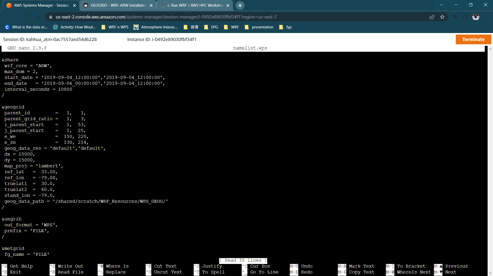
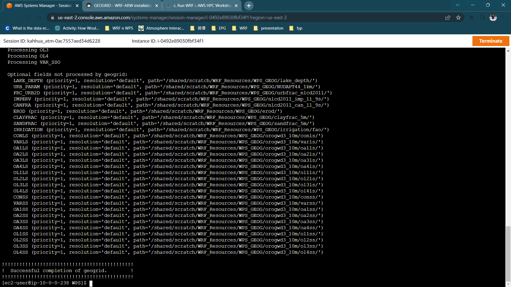
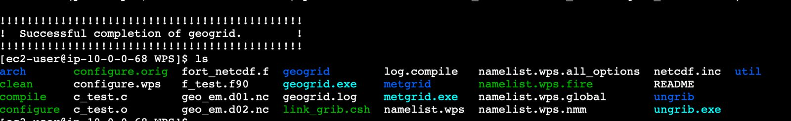
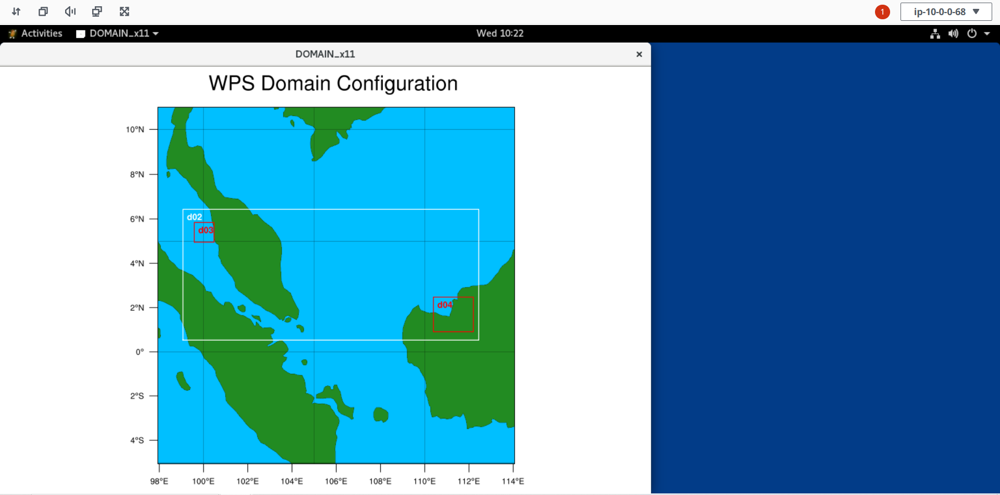
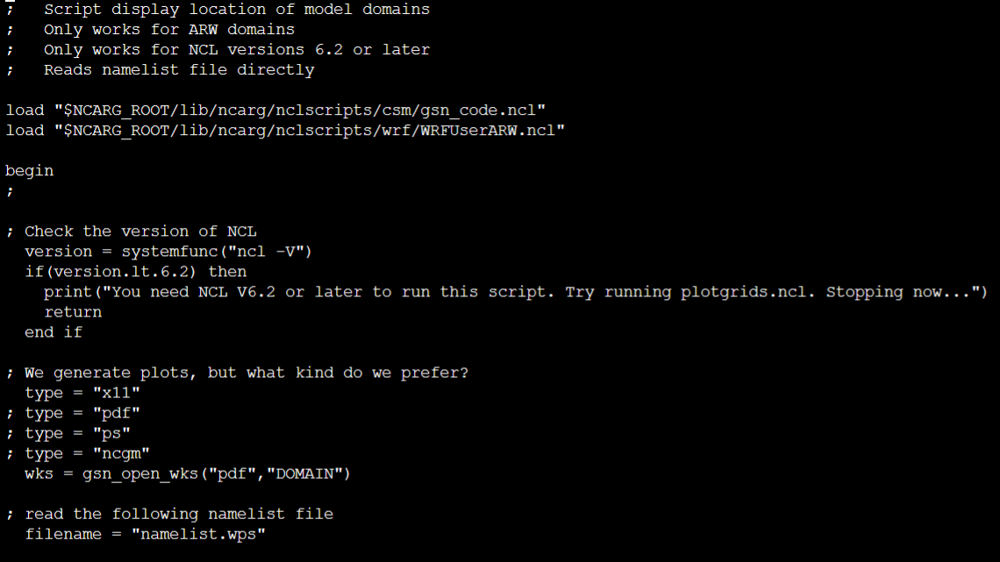
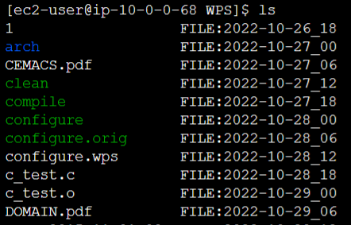
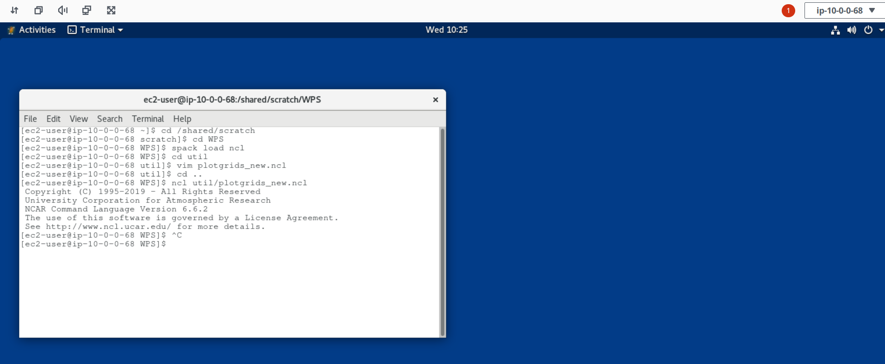
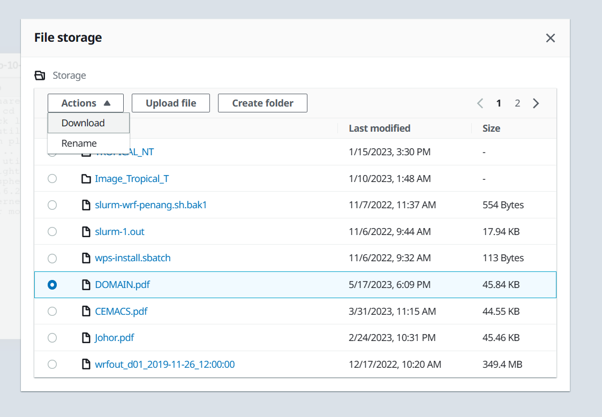

# Geogrid

## **Preliminary**

Before we start executing `geogrid.exe`, `ungrib.exe`, and `metgrid.exe`, we need to create a folder named `WRF_Resources` to put all the required input data for WPS. We will download all the required data into the `/scratch` folder. If you have downloaded them, proceed to edit the `&geogrid` section in the `namelist.wps`.

    cd /shared/scratch
    mkdir WRF_Resources
    cd WRF_Resources

## **Download the geogrid data**   

You can download the mandatory high-resolution data from the official website of UCAR: 
[Download data](https://www2.mmm.ucar.edu/wrf/users/download/get_sources_wps_geog.html){target=_blank} for the input of `geogrid.exe`. There are two types of datasets available, each made up of the highest and lowest resolution of each mandatory field. You may read the details on the official website to decide on the data that suits your needs. In this case, we will be using the highest resolution of each mandatory field.

    wget https://www2.mmm.ucar.edu/wrf/src/wps_files/geog_high_res_mandatory.tar.gz
    tar -xf geog_high_res_mandatory.tar.gz

## **Edit the geog_data_path in the namelist.wps**   

Point the directory of high-resolution data to WRF_Resources in the `nameslist.wps`. To do that, you will first have to obtain the path to `WPS_GEOG`.

    cd WPS_GEOG
    pwd

Copy the path and go to the directory `/shared/scratch/WPS/WRF_Resources/WPS_GEOG/` where your WPS was compiled and edit the `namelist.wps`.

    cd /shared/scratch/WPS/
    nano namelist.wps

Under the `&geogrid` section, edit the `geog_data_path` and save it.

## **Edit the &geogrid section in namelist.wps** 

Before executing `geogrid.exe`, edit the information in the namelist according to your case. Read the description for each listed variable in the namelist, as well as [best practice](https://www2.mmm.ucar.edu/wrf/users/namelist_best_prac_wps.html){target=_blank} here. We will be using the information provided in the Resources tab in this tutorial. 

Export the `LD_LIBRARY_PATH` and run the `geogrid.exe`. Ensure you had loaded the `intel-oneapi-compilers` and `intel-oneapi-mpi` using `spack` to avoid the issue of missing `libiomp5.so`. 

    export LD_LIBRARY_PATH=$(spack location -i netcdf-fortran%intel)/lib/
    spack load intel-oneapi-compilers
    spack load intel-oneapi-mpi
    ./geogrid.exe

If `geogrid.exe` runs successfully, the following output will be printed: `Successful completion of geogrid.`

The files that will be created by the run will be in the folder. They are shown in the image below:

    ls

## **View and adjust namelist.wps to fully cover the domain interested before running the simulations**

First, open a nice DCV session. Go to the WPS directory, which in this case is `/shared/scratch/WPS/`. Now we are going to load the `ncl` package using `spack`.

    spack load ncl

Now, type the following command to view the plot. Pay attention to the use of the new script as it is written for NCL version 6.2 or later.

    ncl util/plotgrids_new.ncl

You have created the plot using DCV! 

Now repeat the previous process of editing the namelist to adjust the simulation so that it covers the interested domain. Be noted that this is for temporary viewing only. Proceed to the next section if you want to save the file locally.

## **Create plots in pdf format**

To export the image to PDF in the cluster, we are going to edit the `ncl` script in the `util` folder.

    cd /shared/scratch/WPS/util
    vim plotgrids_new.ncl

Look for the part where it starts with `We generate plots, but what kind do we prefer?`. Change the type from `x11` to `pdf` and save. After `x11` describes the title, you can name your file. In this case, we will name it `DOMAIN`.

Run the `ncl` script in the WPS folder again using the DCV session. If successful, you will see a file named DOMAIN.pdf.

Now, we are going to export the file to the local computer. Copy the `DOMAIN.pdf` to the home directory.

    cp DOMAIN.pdf /home/ec2-user

Export the file from the DCV session by clicking the file storage icon. Choose the file interested, and click `Actions` to download the file.

