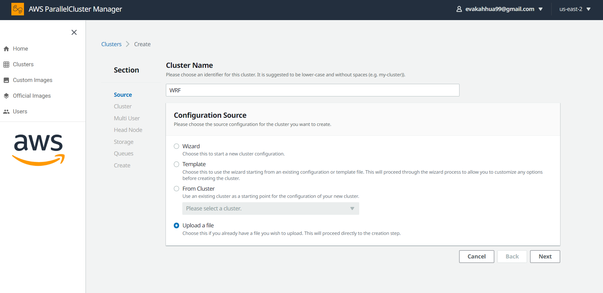
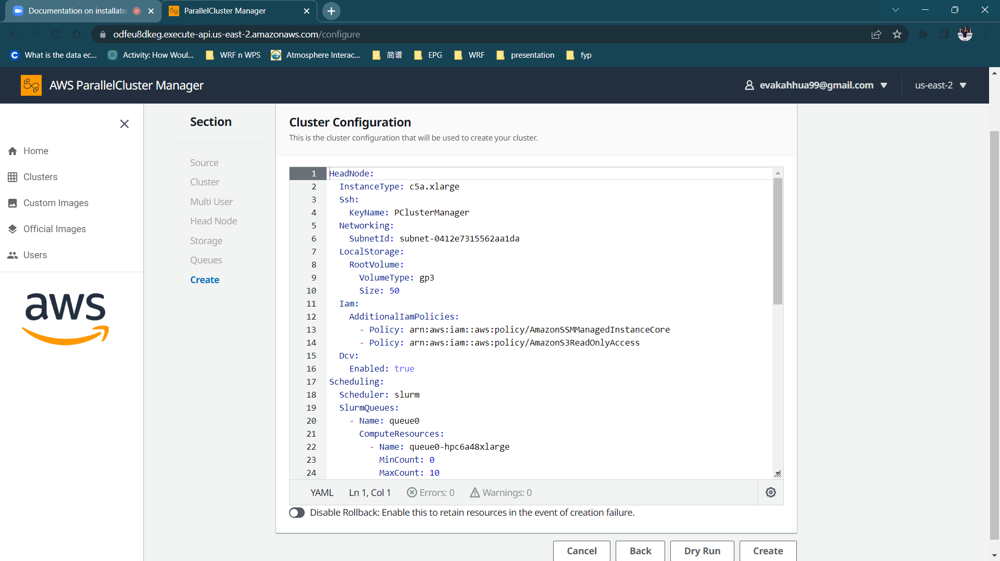
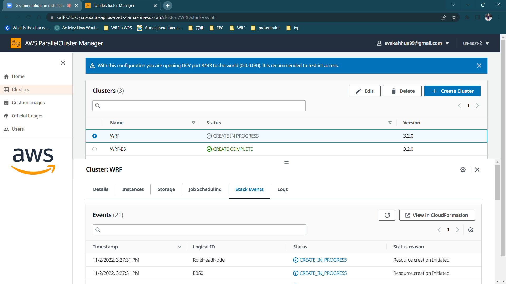
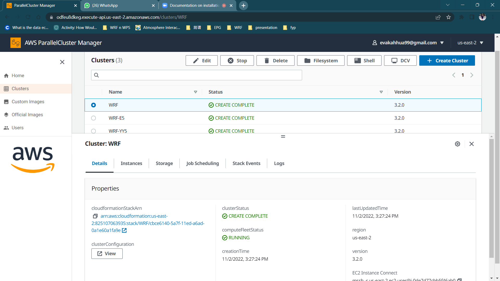

[Local Link](/resources)


This tutorial will cover from the cluster creation using PClusterManager to the configuration and compilation of WRF Version 4.3.3 (Weather Research and Forecasting) and WPS version 4.3.1 (WRF Preprocessing System) using Spack.

# Create Cluster

We have to create a computer cluster on AWS to install and run WRF. The links to AWS and PCluster Managers are below. Go to the PCluster link to create the cluster after having a account on AWS.

* Link to AWS
* Link to PCluster Manager



## **Upload YML file**

PCluster Manager makes it easy for us to create and manage the clusters through interface. This is an example configuration. For your first time, you may choose to upload the yml file we have prepared for you and configure to your prefered headnode and shared storage later by updating the yaml file further. In order for AWS to verify your identity, you will need to create your own [EC2 Key Pair](https://docs.aws.amazon.com/AWSEC2/latest/UserGuide/create-key-pairs.html){target=_blank} using Amazon EC2.  

``` yaml linenums="1" title="YAML File"
HeadNode:
  InstanceType: c5a.xlarge
  Ssh:
    KeyName: PClusterManager
  Networking:
    SubnetId: subnet-0412e7315562aa1da
  LocalStorage:
    RootVolume:
      VolumeType: gp3
      Size: 50
  Iam:
    AdditionalIamPolicies:
      - Policy: arn:aws:iam::aws:policy/AmazonSSMManagedInstanceCore
      - Policy: arn:aws:iam::aws:policy/AmazonS3ReadOnlyAccess
  Dcv:
    Enabled: true
Scheduling:
  Scheduler: slurm
  SlurmQueues:
    - Name: queue0
      ComputeResources:
        - Name: queue0-hpc6a48xlarge
          MinCount: 0
          MaxCount: 10
          InstanceType: hpc6a.48xlarge
          Efa:
            Enabled: true
            GdrSupport: true
          DisableSimultaneousMultithreading: true
      Networking:
        SubnetIds:
          - subnet-01a39ae1f7194644a
        PlacementGroup:
          Enabled: true
      ComputeSettings:
        LocalStorage:
          RootVolume:
            VolumeType: gp3
            Size: 50
      Iam:
        AdditionalIamPolicies:
          - Policy: arn:aws:iam::aws:policy/AmazonS3ReadOnlyAccess
Region: us-east-2
Image:
  Os: alinux2
SharedStorage:
  - Name: Ebs0
    StorageType: Ebs
    MountDir: /shared
    EbsSettings:
      VolumeType: gp3
      DeletionPolicy: Delete
      Size: '200'
      Encrypted: false
```

## **Create Cluster**



* Dry Run

You can opt to dry run your cluster before creating it. After dry run, you will see this message printed: `Request would have succeeded, but DryRun flag is set`.


* Create

Creating cluster will take around 15-20 minutes. You may check if you are interested in the steps or current progress of stack events.

## **Create in Progress**



## **Create Complete**

Now you should be able to see the cluster `WRF` in `CREATE_COMPLETE` status from your PCluster Manager interface. Click on Shell and login to your own AWS account to access the terminal.
 


