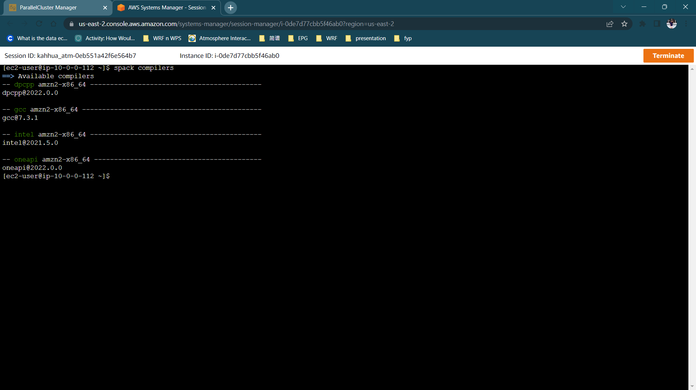

# Intel Compiler Installation

    spack install --no-cache intel-oneapi-compilers@2022.0.2

Check that the compiler is installed.

    spack find

Load the installed compiler onto Spack so that it recognizes it as a compiler.

    spack load intel-oneapi-compilers
    spack compiler find
    spack unload

Then, check the `spack compilers` command. You should see the Intel compiler that you just installed.

    spack compilers

## **Install Intel MPI**

Install Intel MPI using the compiler you just installed.

    spack install --no-cache intel-oneapi-mpi+external-libfabric%intel

