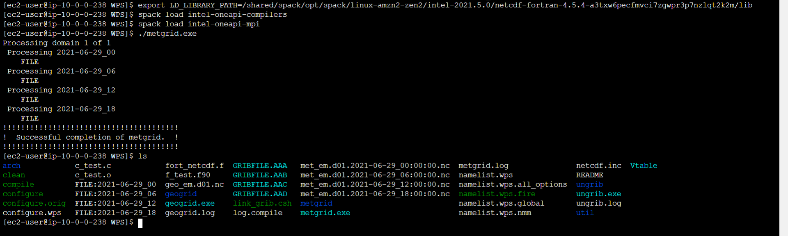

# METGRID

Now, you have reached the final step for the run of WPS. Metgrid will horizontally interpolate the meteorological fields from `ungrib` to simulation grids defined by `geogrid`. 

## **Export the library path**

Just like `geogrid` and `ungrib`, export the library path.

    export LD_LIBRARY_PATH=/shared/spack/opt/spack/linux-amzn2-zen2/intel-2021.5.0/netcdf-fortran-4.5.4-a3txw6pecfmvci7zgwpr3p7nzlqt2k2m/lib

## **Load the compilers**

    spack load intel-oneapi-compilers
    spack load intel-oneapi-mpi

## **Run metgrid**

Run the metgrid. There will be four outputs expected with the name `met_em*` in this tutorial.

    ./metgrid.exe 

