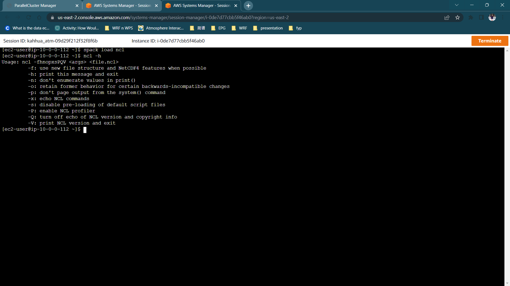

# NCL Installation

## **Install NCL**

Using the binary cache, this should take only around 5 minutes. Once installed, check whether ncl is available. 


    spack install ncl^hdf5@1.8.22

```
spack load ncl
ncl -h
```



Now we set up the NCL X11 window size `1000 x 1000` to view the WRF output later. 


```
cat << EOF > $HOME/.hluresfile
*windowWorkstationClass*wkWidth  : 1000
*windowWorkstationClass*wkHeight : 1000
EOF
```
