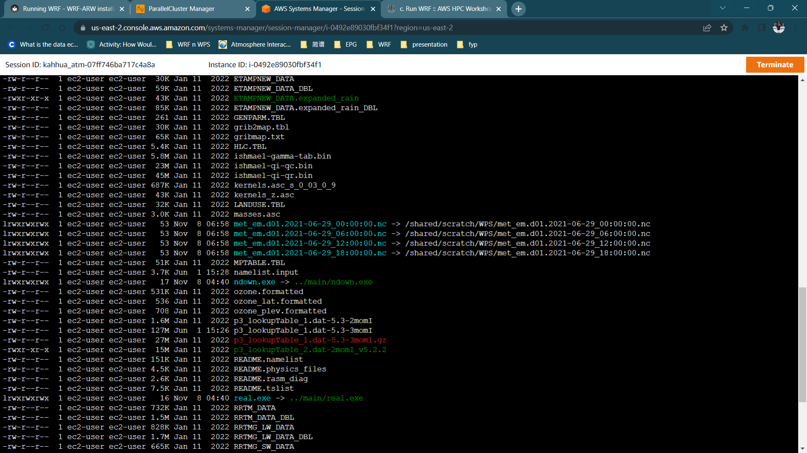
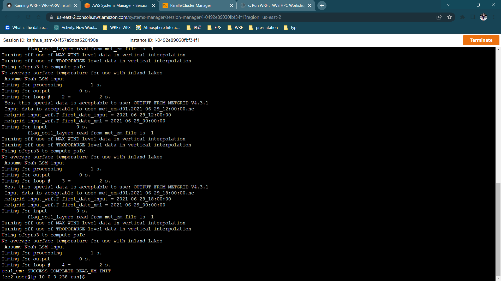
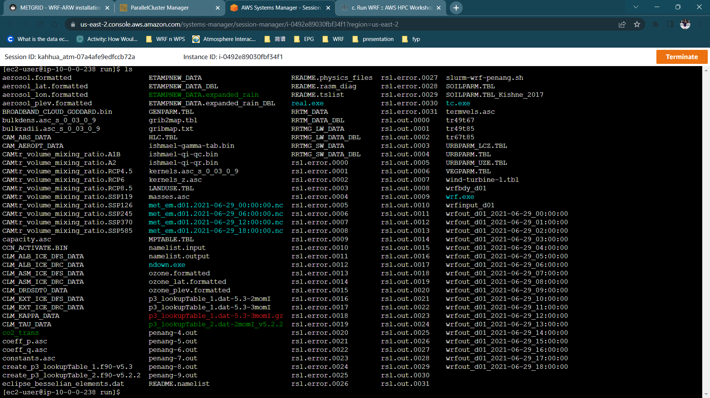

# Running WRF

Congratulations on your successful running of WPS 🥳 Now you are just one step away! Copy the WRF file in the newly created WRF folder in `/scratch`. Go into the `WRF/run` directory and link `met_em*` file.
   
 
    cd /shared/scratch
    mkdir WRF
    cd WRF
    cp -a $(spack location -i wrf%intel)/. /shared/scratch/WRF
    cd run
    ln -sf /shared/scratch/WPS/met_em* .
    ls -alh



Edit the `namelist.input` and make necessary changes or simply overwrite the namelist from the Resources tab. The details including `&time_control` and `&domains` has to be the same as defined in the `namelist.wps`.You may change the `&physics` option here too. Refer to [UCAR Website](https://www2.mmm.ucar.edu/wrf/users/namelist_best_prac_wrf.html){target=_blank} for the best practices.


    nano namelist.input


Execute the real program. Load the `WRF` package before you run.


    spack load wrf
    mpirun -np 1 ./real.exe


Check the rsl.error files to ensure that the run was successful. To do that, you can use the tail command. Usually, the `rsl.error0000` will contain the most information.This indicate the successful run of `real.exe`, `real_em: SUCCESS COMPLETE REAL_EM INIT`.


    tail rsl.error.0000



Now you are ready to run the `wrf.exe`. We can use the slurm to submit and distribute the tasks for us. In order for the slurm to run wrf, make sure that it is in the same directory where your wrf.exe is located. Kindly amend the information according to your need. 

```
cat <<EOF > slurm-wrf-penang.sh
#!/bin/bash
#SBATCH --job-name=WRF
#SBATCH --output=penang-%j.out
#SBATCH --nodes=2
#SBATCH --ntasks-per-node=16
#SBATCH --exclusive

spack load wrf
set -x
wrf_exe=$(spack location -i wrf)/run/wrf.exe
ulimit -s unlimited
ulimit -a

export OMP_NUM_THREADS=6
export FI_PROVIDER=efa
export I_MPI_FABRICS=ofi
export I_MPI_OFI_LIBRARY_INTERNAL=0
export I_MPI_OFI_PROVIDER=efa
export I_MPI_PIN_DOMAIN=omp
export KMP_AFFINITY=compact
export I_MPI_DEBUG=4

set +x
module load intelmpi
set -x
time mpirun -np $SLURM_NTASKS --ppn $SLURM_NTASKS_PER_NODE $wrf_exe
EOF
```

Submit the slurm job. You can check the run by `squeue`.


    spack load intel-oneapi-compilers
    spack load intel-oneapi-mpi
    spack load wrf
    sbatch slurm-wrf-penang.sh


Check the `rsl.out.0000` file to see if the run was successful. You will see a successful message printed at the end of the file.

    tail rsl.out.0000

