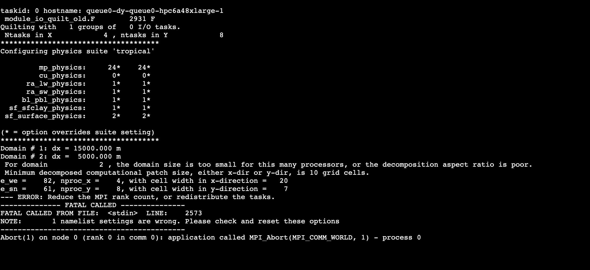

# Segmentation Fault Notes

This section concerns our observations as we worked on WPS and WRF on Pcluster.

## When running real.exe

Segmentation fault would occur frequently during the processing of WRF input files, such as the `met_em` files, using `real.exe`. 

The application `real.exe` would crash when the `met_em` files are too big, e.g., more than 10 MB. Runs with 15 MB or 22 MB files have crashed. This might be rectified if the head node is bigger. The current one is `c5a.xlarge`.

You can try to lower the file size by running `metgrid.exe` using smaller domains, e.g., 125-by-100 and 82-by-82 domains. You might also need to `geogrid.exe` and `ungrib.exe` before running `metgrid.exe`. 

After running `metgrid.exe`, monitor the file size and adjust the `namelist.wps` accordingly.

## When running wrf.exe

This fault could also occur when running WRF using too small domains. The WRF documentation on [best practice](https://www2.mmm.ucar.edu/wrf/users/namelist_best_prac_wps.html){target=_blank} states that it is not advisable to run WRF on a domain of less than 100-by-100. So, optimize the domain size when using WPS and WRF. 

An example error for when the domain is too small is shown below.

## Segmentation fault and nano

If it does occur, you cannot use `nano` to view and edit files. To regain control of `nano`, you must terminate the session and log back in the cluster. It should be working, then. 

Remember that the compilers must be loaded whenever you log back into the cluster. You can load them by running the commands:

    spack load intel-oneapi-compilers
    spack load intel-oneapi-mpi

