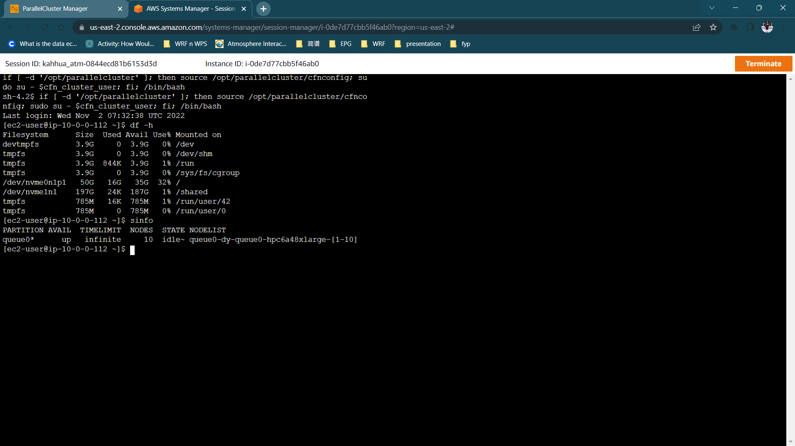
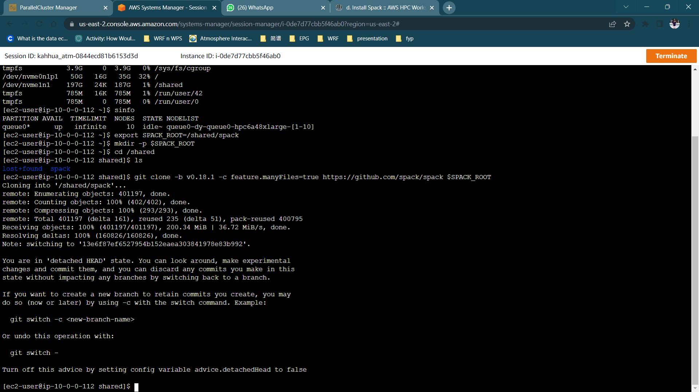

# Spack Installation


## **Verify the Cluster**

It is always good to verify the cluster information (sinfo, filesystems, etc.) before you start the installation. Check the file systems through this command. 

    df -h

Check the basic Slurm information. You will notice that all 10 nodes is in idle state because there is no ongoing activity submitted now.

    sinfo




## **Spack Installation**

Now, we define the variable `SPACK_ROOT` and download `Spack Version 0.18.0` under the `/spack` folder created.

    export SPACK_ROOT=/shared/spack
    mkdir -p $SPACK_ROOT
    git clone -b v0.18.0 -c feature.manyFiles=true https://github.com/spack/spack $SPACK_ROOT



Define the `.bashrc` file and source it to run the preconfigured spack everytime you open a new terminal.

    echo "export SPACK_ROOT=/shared/spack" >> $HOME/.bashrc
    echo "source \$SPACK_ROOT/share/spack/setup-env.sh" >> $HOME/.bashrc
    source $HOME/.bashrc

To check your Spack Version, type this or if you want to know more about the Spack you installed, try `spack -h`. 

    spack -V

Notice that the version installed is `0.18.0`.


**Patchelf Installation**

`Patchelf` is a small utility to modify the dynamic linker and RPATH of ELF executables.

    spack install patchelf

Check the patchelf location and see if it is properly installed. 

    spack find 
    spack load patchelf
    which patchelf

**Spack build cache**
 
Install prerequisites

    pip3 install botocore==1.23.46 boto3==1.20.46

Add the mirror to the binary cache

    spack mirror add aws-hpc-weather s3://aws-hpc-weather/spack/
    spack buildcache keys --install --trust --force    

Adding parallel cluster's softwares to the Spack so that it recognises that these packages are installed. 
Copy and paste the following into your CLI. 

``` linenums="1" title="packages.yaml"
cat << EOF > $SPACK_ROOT/etc/spack/packages.yaml
packages:
    libfabric:
        variants: fabrics=efa,tcp,udp,sockets,verbs,shm,mrail,rxd,rxm
        externals:
        - spec: libfabric@1.13.2 fabrics=efa,tcp,udp,sockets,verbs,shm,mrail,rxd,rxm
          prefix: /opt/amazon/efa
        buildable: False
EOF
```