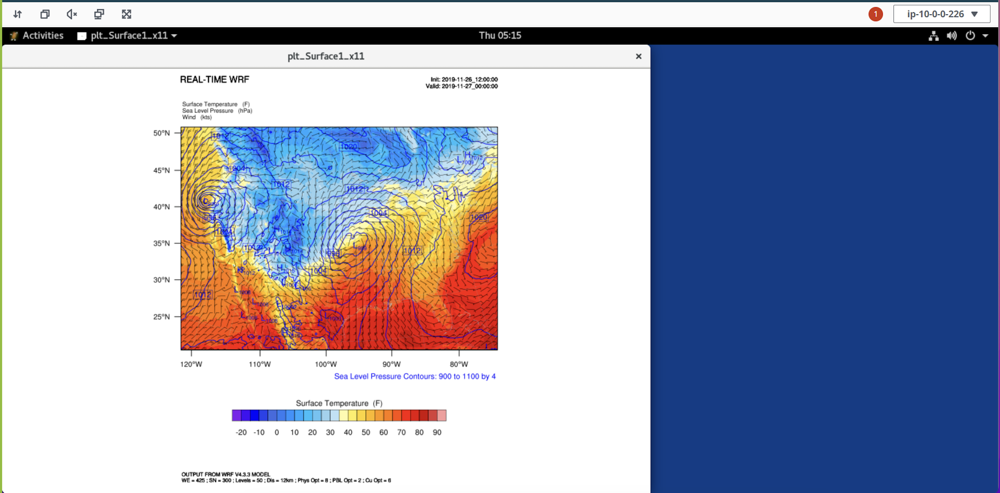

# Testing WRF

To check if the WRF installed can run properly, input data used are 12-km CONUS input. These are used to run the WRF executable (wrf.exe) to simulate atmospheric events that took place during the [Pre-Thanksgiving Winter Storm of 2019](https://weather.com/storms/winter/news/2019-11-24-snowstorm-rockies-denver-plains-midwest-thanksgiving-week){target=_blank}. The model domain includes the entire Continental United States (CONUS), using 12-km grid spacing, which means that each grid point is 12x12 km. The full domain contains 425 x 300 grid points. After running the WRF model, post-processing will allow visualization of atmospheric variables available in the output (e.g., temperature, wind speed, pressure).

## **Load WRF**

Load the package WRF in spack.

    spack load wrf

Find the executable for `WRF`. You should expect four executables: `real.exe`, `wrf.exe`, `ndown.exe` and `tc.exe` for a successful compilation. 

    ls `spack location -i wrf`/run/

Create scratch folder under `/shared`.

    cd /shared
    mkdir scratch
    cd scratch

Download the file.  

    curl -O https://www2.mmm.ucar.edu/wrf/OnLineTutorial/wrf_cloud/wrf_simulation_CONUS12km.tar.gz
    tar -xzf wrf_simulation_CONUS12km.tar.gz

Next we’ll prepare the data for a run by copying in the relevant files from our WRF install.It is safe to ignore the error message `ln: failed to create symbolic link ‘./namelist.input’: File exists` since there is existing namelist.input file that contains all the necessary information for the run.

    cd conus_12km
    WRF_ROOT=$(spack location -i wrf%intel)/test/em_real/
    ln -s $WRF_ROOT* .

Let's create a Slurm job submission script in the conus_12km. This file specifies the job submission script as follows:

  - Using 2x Hpc6a.48xl instances 
  - Each node has 16 MPI processes (--ntasks-per-node=16)
  - Each node has 6 OpenMP threads (export OMP_NUM_THREADS=6)


```
cat <<EOF > slurm-wrf-conus12km.sh
#!/bin/bash
#!/bin/bash
#SBATCH --job-name=WRF
#SBATCH --output=conus-%j.out
#SBATCH --nodes=2
#SBATCH --ntasks-per-node=16
#SBATCH --exclusive

spack load wrf
set -x
wrf_exe=\$(spack location -i wrf)/run/wrf.exe
ulimit -s unlimited
ulimit -a

export OMP_NUM_THREADS=6
export FI_PROVIDER=efa
export I_MPI_FABRICS=ofi
export I_MPI_OFI_LIBRARY_INTERNAL=0
export I_MPI_OFI_PROVIDER=efa
export I_MPI_PIN_DOMAIN=omp
export KMP_AFFINITY=compact
export I_MPI_DEBUG=4

set +x
module load intelmpi
set -x
time mpirun -np \$SLURM_NTASKS --ppn \$SLURM_NTASKS_PER_NODE \$wrf_exe
EOF
```
Submit the run using the Slurm Workload Manager.

    sbatch slurm-wrf-conus12km.sh

##**DCV**

Open a NICE DCV session through PCluster Manager.Once you are connected over NICE DCV, open the terminal and execute the following.

    cd /shared/scratch/conus_12km 
    spack load ncl
    ncl ncl_scripts/surface.ncl



You can also generate a vertical profile of relative humidity (%) and temperature (K).

    cd /shared/scratch/conus_12km 
    spack load ncl    
    ncl ncl_scripts/vert_crossSection.ncl
