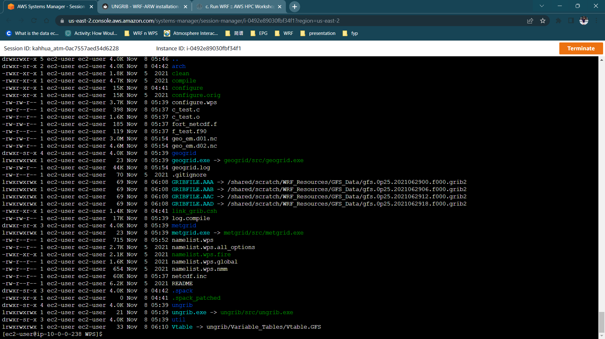
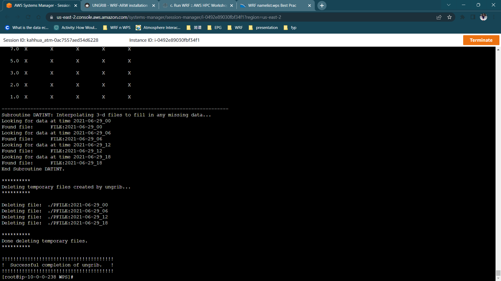
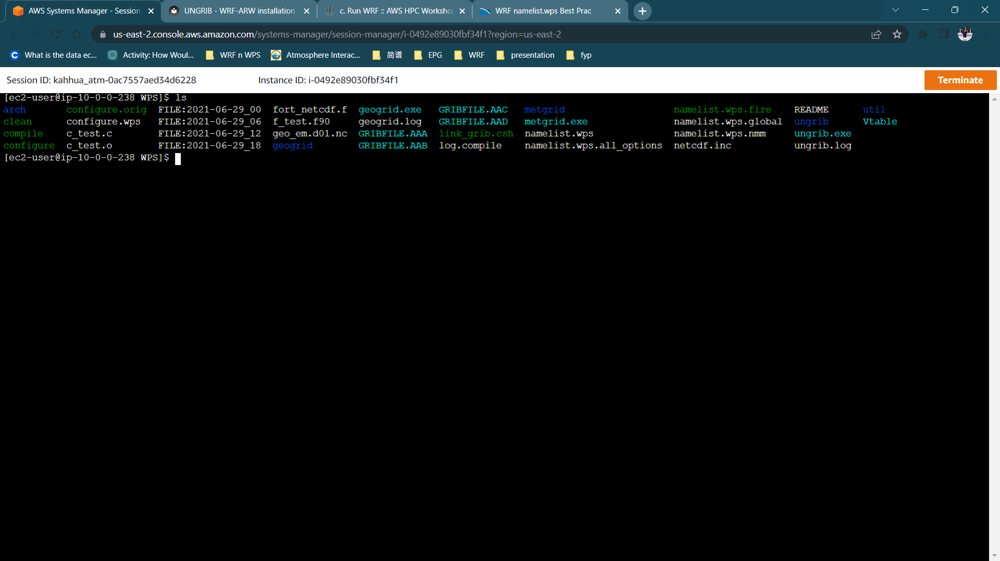

# UNGRIB 

Create GFS data under `/WRF_Resources` that you just created. 

    cd /shared/scratch/WRF_Resources
    mkdir GFS_Data
    cd GFS_Data

Before you start using the Python script, check the website [Research Data Archive website](https://rda.ucar.edu/datasets/ds084.1/index.html){target=_blank} to see if the data sets for your interested dates are available. Create a Python script to download the GFS Data. 


``` py linenums="1" title="gfs_downloader.py"
cat <<EOF > gfs_downloader.py
#!/usr/bin/env python

import sys, os
import requests
from datetime import datetime, timedelta

def download_file(session, filename, cookies, output_file_path):
    print('Downloading', os.path.basename(filename))
    req = session.get(filename, cookies=cookies, allow_redirects=True, stream=True)

    with open(output_file_path, 'wb') as outfile:
        for chunk in req.iter_content(chunk_size=32768):  # Increased chunk size for potentially faster downloads
            outfile.write(chunk)

    file_size = os.path.getsize(output_file_path) / (1024 * 1024)
    print(f"{os.path.basename(filename)} download completed. File size: {file_size:.2f} MB")
    
def generate_filelist(start_date, end_date, hours_interval):
    s_date = datetime.strptime(start_date, "%Y/%m/%d")
    e_date = datetime.strptime(end_date, "%Y/%m/%d")
    
    # Generate the list of dates between start and end dates
    dates = []
    while s_date <= e_date:
        dates.append(s_date)
        s_date += timedelta(days=1)

    # Generate the file paths based on the given hour interval and the dates
    filepaths = []
    for idx, date in enumerate(dates):
        max_hour = 24 if idx != len(dates)-1 else 1
        for hour in range(0, max_hour, hours_interval):
            filepath = "{}/{}/gfs.0p25.{}{:02d}.f000.grib2".format(
                date.strftime("%Y"),
                date.strftime("%Y%m%d"),
                date.strftime("%Y%m%d"),
                hour
            )
            filepaths.append(filepath)

    return filepaths

def check_file_status(filepath, filesize):
    sys.stdout.write('\r')
    sys.stdout.flush()
    size = int(os.stat(filepath).st_size)
    percent_complete = (size/filesize)*100
    sys.stdout.write('%.3f %s' % (percent_complete, '% Completed'))
    sys.stdout.flush()

# Check for 3 arguments now (script name, orcid_id, and api_token)
if len(sys.argv) < 3 and not 'RDAID' in os.environ: 
    try:
        import getpass
    except:
        try:
            input = raw_input  # For Python 2
        except:
            pass
    orcid_id = input('Orcid ID: ')
    api_token = getpass.getpass('API Token: ')  # Use getpass just for the password
else:
    try:
        orcid_id = sys.argv[1]
        api_token = sys.argv[2]
    except:
        orcid_id = os.environ['RDAID']
        api_token = os.environ['RDATOKEN']

url = 'https://rda.ucar.edu/cgi-bin/login'
values = {'orcid_id' : orcid_id, 'api_token' : api_token, 'action' : 'tokenlogin'}

# Authenticate
ret = requests.post(url,data=values)


if ret.status_code != 200:
    print('Bad Authentication')
    print(ret.text)
    exit(1)
dspath = 'https://data.rda.ucar.edu/ds084.1/'

# Get user input using standard input
start_date = input("start date (format: YYYY/MM/DD): ")
end_date = input("end date (format: YYYY/MM/DD): ")
hours = int(input("hours interval (e.g., 6): "))

filelist = generate_filelist(start_date, end_date, hours)
for item in filelist:
    print(item)

print('\n')

# Create a directory based on the start and end dates
folder_name = "{}_{}".format(start_date.replace("/", "-"), end_date.replace("/", "-"))
if not os.path.exists(folder_name):
    os.makedirs(folder_name)

    
session = requests.Session()

for file in filelist:
    filename = dspath + file
    file_base = os.path.basename(file)
    output_file_path = os.path.join(folder_name, file_base)
    
    # Download files sequentially
    download_file(session, filename, ret.cookies, output_file_path)    
EOF
```


Execute the Python script to download the data. You must be a registered user on the NCAR website because you will be asked for a password before permission to download the data is granted. After executing the Python code, enter your NCAR website username and password. Then, input the start date, end date, and hourly time interval; the code will then generate a list of files to download.

    pip3 install requests    
    python3 gfs_downloader.py


Obtain the path to your `GFS_Data`, where, in this case, it is `/shared/scratch/WPS`. Go back to the directory where your WPS is compiled and create the symbolic links to the GFS data that you just downloaded. You should expect four GRIBFILE with the same prefix but different labels behind, `AAA`, `AAB`, `AAC` and `AAD`.


    cd /shared/scratch/WPS
    ./link_grib.csh /shared/scratch/WRF_Resources/GFS_Data/folder_name/gfs.*


Create the symbolic link to the Vtable.

    ln -sf ungrib/Variable_Tables/Vtable.GFS Vtable
    ls -alh




Now, it is time to edit the `namelist.wps`. Below are a few things that should be amended according to the GFS data: 

- start date 
- end date 
- the interval seconds that describe the interval of your GFS data


```
nano namelist.wps
```

Increase your stack limit as the superuser.

    sudo -s
    ulimit -s unlimited

Export the library path.

    export LD_LIBRARY_PATH=/shared/spack/opt/spack/linux-amzn2-zen2/intel-2021.5.0/jasper-2.0.31-skcu73p6hnlgov6teechaq6muly2xrez/lib64/:\$LD_LIBRARY_PATH


Run the `ungrib`.

    ./ungrib.exe


You will see the successful output printed out after `ungrib.exe` and four outputs with the prefix `FILE` are created.




Remember to exit the superuser by typing exit.

    exit