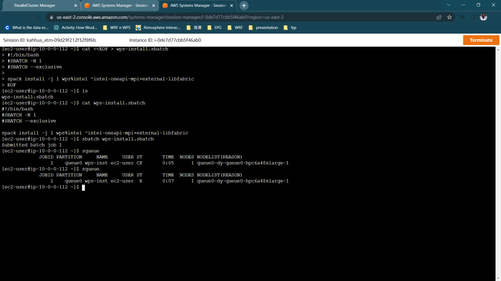
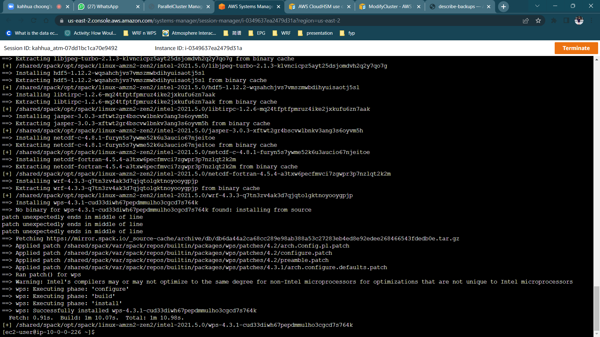
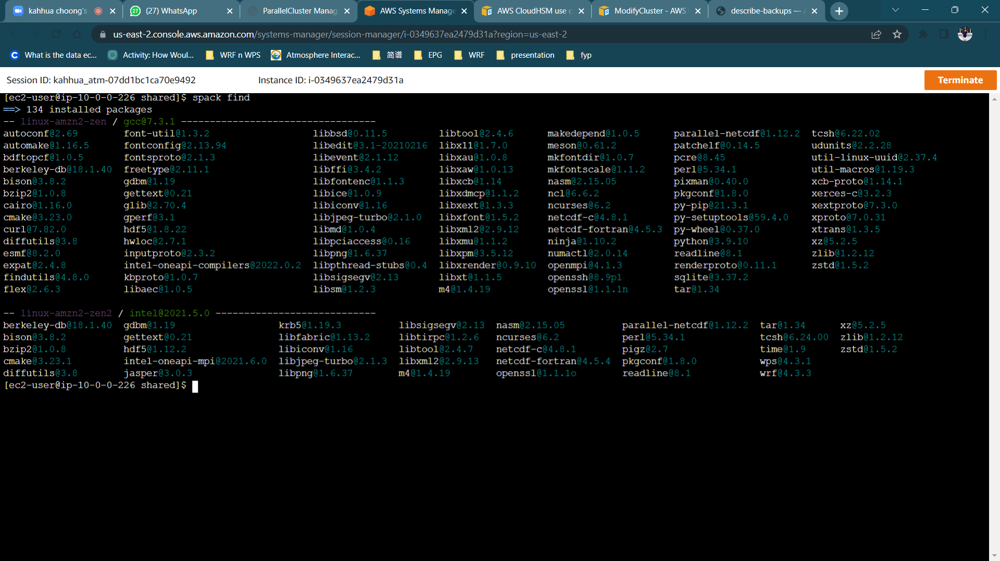

# WPS Installation

```
cat <<EOF > wps-install.sbatch
#!/bin/bash
#SBATCH -N 1
#SBATCH --exclusive


spack install -j 1 wps%intel ^intel-oneapi-mpi+external-libfabric
EOF
```

    sbatch wps-install.sbatch


## **Checking the Clusters**

    squeue



    cat slurm-<jobID>.out

-- or

    tail slurm-<jobID>.out



    spack find

