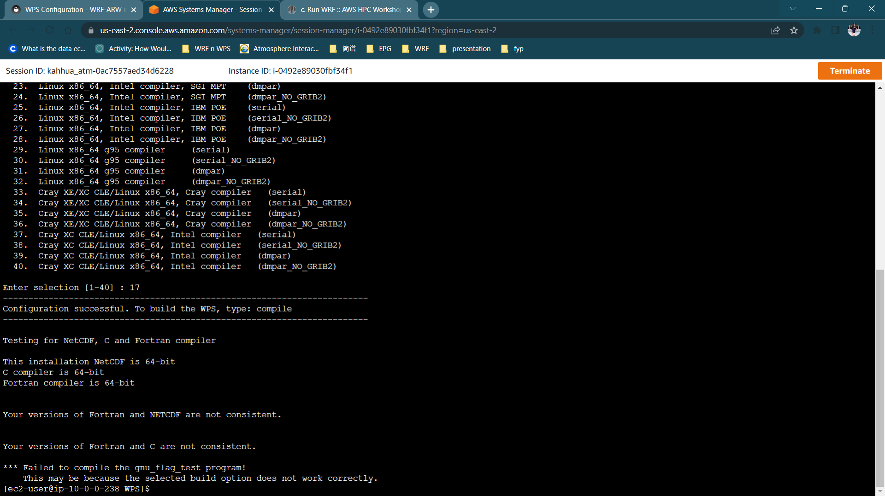

# WPS Configuration

## **Create a soft link for the WPS**

Load the compilers before you do anything.
    
    spack load intel-oneapi-compilers
    spack load intel-oneapi-mpi

!!! Warning

    Copy the WPS folder instead of using soft links.


```
cd /shared/scratch
mkdir WPS
cp -a $(spack location -i wps%intel)/. WPS/
cd WPS
ls
```

## **Jasper Installation**

Jasper is needed for WPS, so you have to install it.

    spack install jasper@2.0.31%intel

Check if the `jasper version 2.0.31` is installed.

    spack find


## **Export**

Export the paths needed for WPS to work.

    export JASPERLIB=$(spack location -i jasper@2.0.31%intel)/lib64
    export JASPERINC=$(spack location -i jasper@2.0.31%intel)/include
    export WRF_DIR=$(spack location -i wrf%intel)
    export NETCDFINC=$(spack location -i netcdf-fortran%intel)/include
    export NETCDFLIB=$(spack location -i netcdf-fortran%intel)/lib
    export NETCDF=$(spack location -i netcdf-fortran%intel)
    export NETCDFF=$(spack location -i netcdf-fortran%intel)
    export LD_LIBRARY_PATH=/shared/spack/opt/spack/linux-amzn2-zen2/intel-2021.5.0/jasper-2.0.31-skcu73p6hnlgov6teechaq6muly2xrez/lib64=/shared/spack/opt/spack/linux-amzn2-zen2/intel-2021.5.0/netcdf-fortran-4.5.4-izf5fn4mw4y4mcgdjed7jp7bypsfi3s2/lib:\$LD_LIBRARY_PATH

Check if the variables are imported correctly.

    echo $NETCDFINC
    echo $NETCDFLIB
    
Copy the contents of `lib` and include `netcdf-c` to `netcdf-fortran` of the Intel compilers.

    cp -a $(spack location -i netcdf-c%intel)/include/. $(spack location -i netcdf-fortran%intel)/include/
    cp -a $(spack location -i netcdf-c%intel)/lib/. $(spack location -i netcdf-fortran%intel)/lib/ 


## **Edit configure.wps File**   

Configure the WPS installation.

    ./configure


Choose '17', for Intel serial compilers.

If you did not set the path for `NETCDFINC`, type `Y`, then paste the `NETCDFINC` paths as given above.


    nano configure.wps


Look for `WRF_LIB` and add `-qopenmp` after `-lnetcdff -lnetcdf` then save.


Before compiling, notice the original copied files of WPS. You can view them by typing:

    ls


## **Compile**  
    
    ./compile > log.compile



After compiling, you should see new files created in the folder. You can view them by typing:

    ls


## **Clean**

If you want to start over the creation of the WPS executables, you can use the command below. Note that it will not delete any files, e.g., `met_em`, `.nc`, etc., other than those created in the compilation process

!!! note

    to reset WPS settings!
        
        ./clean -a


